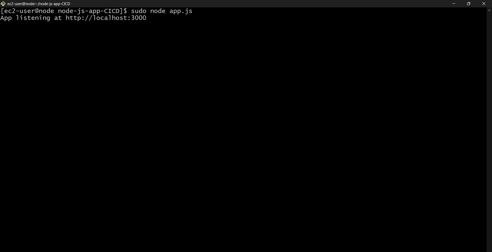
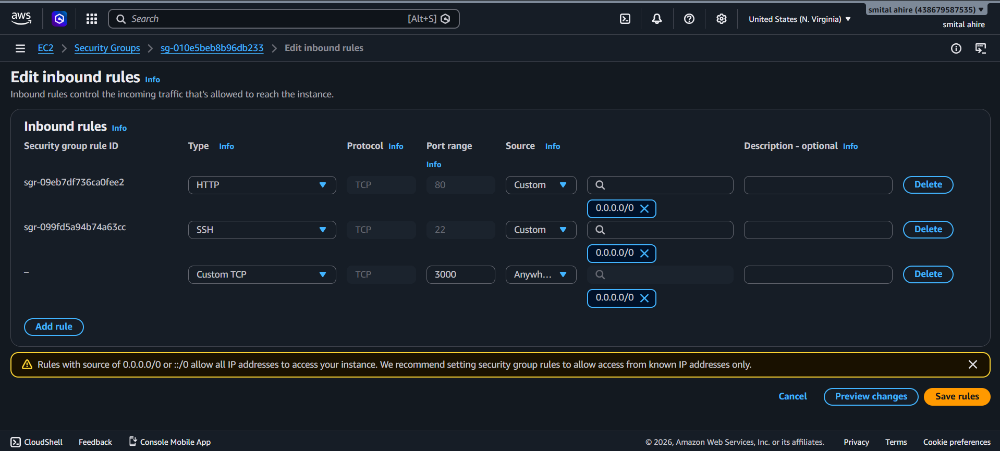
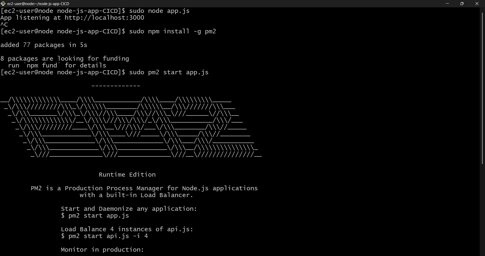
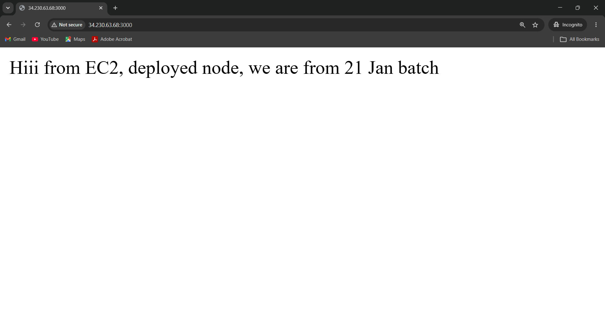

# Node.js Application Deployment on AWS EC2

## Overview

This project demonstrates the deployment of a simple Node.js application on an AWS EC2 instance running Amazon Linux 2023. The objective was to understand the complete deployment process, from launching a virtual server to making the application accessible over the internet.

The application was managed using PM2 to keep it running even after the terminal session was closed.

---

## Technologies Used

- AWS EC2
- Amazon Linux 2023
- Node.js
- Express.js
- PM2
- Git
- SSH

---

## Deployment Steps

### 1. Launch an EC2 Instance

- Created an EC2 instance using the Amazon Linux 2023 AMI.
- Selected the `t3.micro` instance type.
- Generated a new key pair for secure SSH access.

---

### 2. Connect to the Instance

Connected to the EC2 instance using SSH.

```bash
ssh -i "your-key.pem" ec2-user@<Public-IP>
```

---

### 3. Change the Hostname

Updated the hostname to make the server easier to identify.

```bash
sudo hostnamectl hostname node
```

---

### 4. Clone the Application

Downloaded the Node.js project from GitHub.

```bash
git clone <repository-url>
cd node-js-app-CICD
```

---

### 5. Install Dependencies

Installed the required Node.js packages.

```bash
npm install
```

---

### 6. Configure the Security Group

Added an inbound rule to allow traffic on port **3000** so the application could be accessed from a web browser.

| Type | Port |
|------|------|
| SSH | 22 |
| Custom TCP | 3000 |

---

### 7. Run the Application

Started the application.

```bash
node app.js
```

Verified that it was running successfully.

---

### 8. Install and Configure PM2

Installed PM2 globally and started the application as a managed process.

```bash
sudo npm install -g pm2

pm2 start app.js

pm2 list
```

Using PM2 ensures that the application keeps running in the background and can be restarted easily if needed.

---

### 9. Access the Application

Opened the application in a browser using the EC2 Public IP.

```
http://<EC2-Public-IP>:3000
```

The application was successfully accessible from the browser.

---

## Screenshots

### EC2 Instance


### SSH Connection


### Hostname Changed


### Application Running



### Security Group Configuration



### PM2 Configuration



### Browser Output



---

## What I Learned

Through this project, I gained practical experience with:

- Launching and managing AWS EC2 instances
- Connecting to Linux servers using SSH
- Basic Linux administration
- Deploying a Node.js application
- Configuring AWS Security Groups
- Managing Node.js applications with PM2
- Accessing deployed applications through a public IP address

---

## Future Improvements

Some enhancements I plan to explore in future deployments include:

- Configuring Nginx as a reverse proxy
- Enabling HTTPS with SSL certificates
- Setting up a CI/CD pipeline using GitHub Actions
- Deploying applications using Docker

---

## Author

**Smital Ahire**

Aspiring Cloud & DevOps Engineer