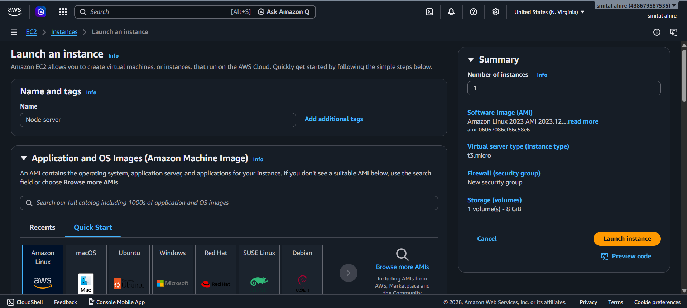
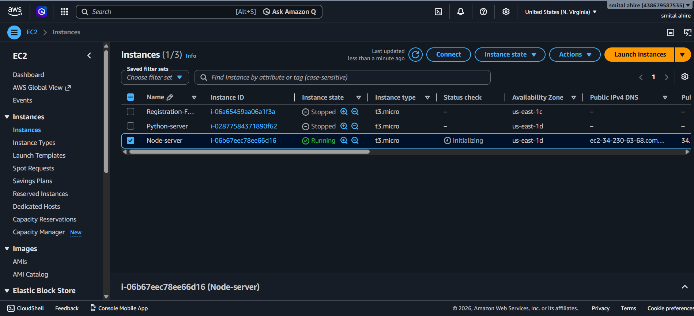
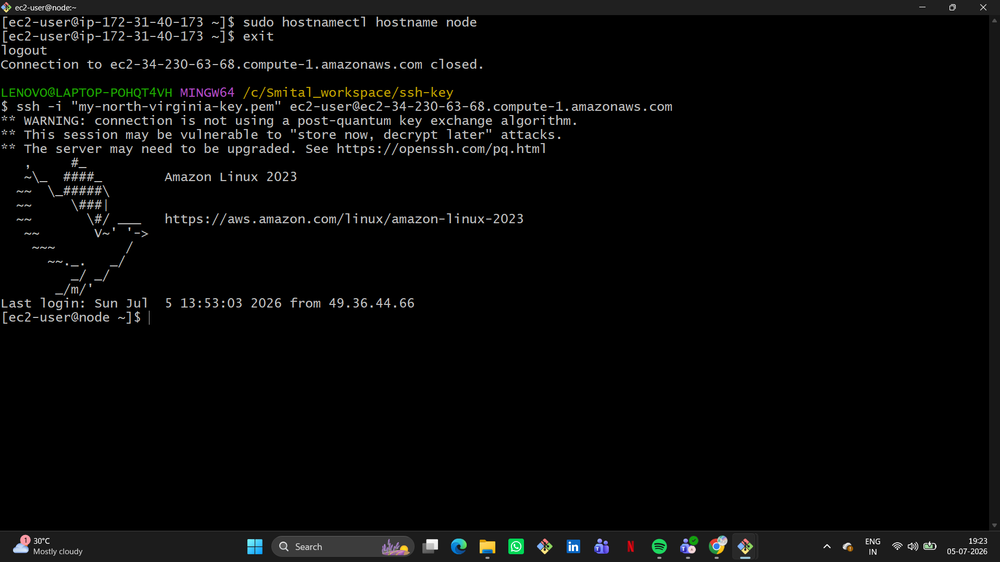

# 🚀 Node.js Application Deployment on AWS EC2

A beginner-friendly project demonstrating how to deploy a Node.js application on an AWS EC2 instance (Amazon Linux 2023) and manage it using PM2.

---

## 📌 Project Overview

This project demonstrates the deployment of a Node.js application on an AWS EC2 instance. It covers launching an EC2 instance, connecting through SSH, configuring the security group, installing dependencies, running the application, managing it with PM2, and accessing it via the EC2 Public IP.

---

## ✨ Features

- Launch an AWS EC2 instance
- Connect to the instance using SSH
- Change the server hostname
- Clone a Node.js application
- Install Node.js dependencies
- Configure the Security Group
- Run the application
- Install and configure PM2
- Access the application using the EC2 Public IP

---

## 🛠️ Tech Stack

- AWS EC2
- Amazon Linux 2023
- Node.js
- Express.js
- PM2
- Git
- GitHub
- SSH

---

## 📂 Project Workflow

### Step 1: Launch an EC2 Instance

- Login to AWS Console
- Navigate to EC2
- Launch a new instance
- Select **Amazon Linux 2023**
- Choose **t3.micro**
- Create or select a Key Pair
- Launch the instance

---

### Step 2: Connect to EC2

```bash
ssh -i "my-north-virginia-key.pem" ec2-user@<Public-IP>
```

---

### Step 3: Change Hostname

```bash
sudo hostnamectl hostname node
exit
```

Reconnect to verify the hostname:

```bash
ssh -i "my-north-virginia-key.pem" ec2-user@<Public-IP>
```

---

### Step 4: Clone the Application

```bash
git clone <repository-url>
cd node-js-app-CICD
```

---

### Step 5: Install Dependencies

```bash
npm install
```

---

### Step 6: Run the Application

```bash
node app.js
```

Output:

```text
App listening at http://localhost:3000
```

---

### Step 7: Configure Security Group

Allow the following inbound rules:

| Type | Port |
|------|------|
| SSH | 22 |
| HTTP | 80 |
| Custom TCP | 3000 |

Source:

```text
0.0.0.0/0
```

---

### Step 8: Install PM2

```bash
sudo npm install -g pm2
```

---

### Step 9: Start the Application with PM2

```bash
sudo pm2 start app.js
```

Check the application status:

```bash
pm2 list
```

Restart the application:

```bash
sudo pm2 restart app.js
```

---

### Step 10: Access the Application

Open your browser and visit:

```text
http://<EC2-Public-IP>:3000
```

---

# 📷 Project Screenshots

## 1. Launch EC2 Instance



---

## 2. Connect to EC2 via SSH



---

## 3. Change Hostname



---

## 4. Run Node.js Application


---

## 5. Configure Security Group


---

## 6. Install PM2


---

## 7. Browser Output


---

# 📚 Commands Used

```bash
ssh -i "my-north-virginia-key.pem" ec2-user@<Public-IP>

sudo hostnamectl hostname node

git clone <repository-url>

cd node-js-app-CICD

npm install

node app.js

sudo npm install -g pm2

sudo pm2 start app.js

pm2 list
```

---

# 🎯 Learning Outcomes

- AWS EC2 instance management
- Amazon Linux 2023 basics
- SSH connectivity
- Node.js application deployment
- Security Group configuration
- PM2 process management
- Basic cloud deployment workflow

---

# 🚀 Future Improvements

- Configure Nginx as a Reverse Proxy
- Enable HTTPS using SSL/TLS
- Deploy using Docker
- Automate deployment with GitHub Actions
- Implement CI/CD Pipeline

---

# 👨‍💻 Author

**Smital Ahire**

Aspiring Cloud & DevOps Engineer
